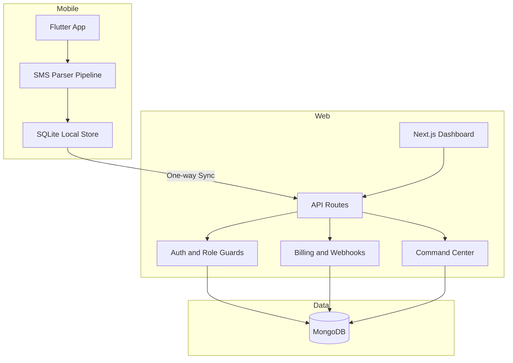
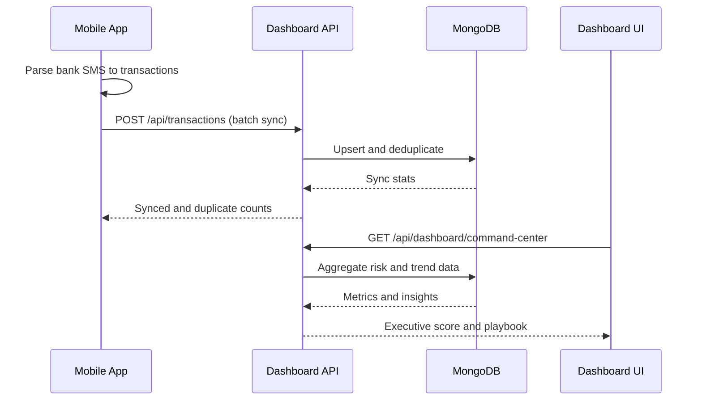

<div align="center">

# DhanPath AI


### Enterprise-Ready Family Finance Intelligence Platform

Transform fragmented transaction data into actionable family decisions with an offline-first mobile pipeline, premium command center analytics, secure payment automation, and audit-grade compliance workflows.

[](https://flutter.dev/)
[](https://nextjs.org/)
[](https://www.typescriptlang.org/)
[](#)
[](https://stripe.com/)

[](https://youtu.be/hg5G3bS4rhg)

[Live Demo](#)  [Architecture](#system-architecture-and-data-flow)  [Quick Start](#quick-start)

</div>

---

## What Makes DhanPath AI Different

DhanPath AI is not just an expense tracker. It is a full product ecosystem that connects mobile capture, family collaboration, premium analytics, billing operations, and compliance-grade reporting in one deployable platform.

### Product Differentiators

| Capability | Typical Finance Apps | DhanPath AI Approach | Outcome |
|------------|----------------------|----------------------|---------|
| SMS Parsing | Basic regex-only extraction | Parser pipeline + transaction dedup + categorization | Higher parsing reliability and cleaner ledgers |
| Payments | Single provider, manual tracking | Stripe + Razorpay + subscription state timeline | Billing flexibility and upgrade readiness |
| Webhooks | Optional or loosely verified | Signature-verified billing webhook automation | Secure post-payment provisioning |
| Family Finance | Single-user reporting | Family workspace with roles, invite flow, member governance | True household-level intelligence |
| Decision Layer | Static charts only | Command Center + risk radar + What-If simulation + plan application | Insight to execution loop |
| Compliance | Manual exports | Audit feed + export + CA pack schedule + tokenized share links | Better governance and CA handoff |
| Demo Stability | Always-online dependency | Offline-first mobile + one-way sync architecture | High reliability for hackathons and field demos |

---

## Hackathon-First Highlights

### 1) Payment Gateway and Subscription Engine
- Dual payment integration support (Razorpay and Stripe).
- Plan and usage-aware subscription model.
- Billing event timeline and invoice export APIs.

### 2) SMS Parsing Core (Innovation Layer)
- Bank SMS ingestion and transaction extraction pipeline.
- Duplicate protection for repeated bank notifications.
- Offline-first local persistence before cloud sync.

### 3) Verified Webhook Automation
- Dedicated billing webhook endpoint.
- Signature verification before accepting events.
- Auto-updates subscription state on successful payment events.

### 4) Command Center for Decision Intelligence
- Executive score and operational health context.
- Risk radar + founder playbook.
- What-If Lab with one-click Apply Plan to Family.

---

## Core Feature Portfolio

### Mobile App (Flutter)
- Offline transaction storage using SQLite.
- SMS-based transaction parsing and categorization.
- Local-first flows for high reliability.
- Cloud sync trigger for dashboard reporting.

### Dashboard (Next.js)
- Premium landing and auth experience.
- Family create/join, members, and role management.
- Overview, analytics, insights, and transactions modules.
- Billing and CA pack operations.

### Governance and Compliance
- Audit log timelines with filters.
- CSV export for audit and billing events.
- CA pack settings, generation, and tokenized share delivery.

### AI and Planning Layer
- Command Center executive snapshot.
- Risk alerts and trend diagnostics.
- Action plan persistence and downstream use in Budget/Goals.

---

## System Architecture and Data Flow





---

## Technology Stack

### Mobile

| Technology | Purpose |
|------------|---------|
| Flutter / Dart | Cross-platform app runtime |
| SQLite (sqflite) | Offline transaction persistence |
| Watermalon UI | Premium mobile UI styling and component direction for polished product experience |
| Telephony APIs | SMS ingestion pipeline |
| Provider | State management |
| Secure Storage / Local Auth | Device-level protection |

### Dashboard and APIs

| Technology | Purpose |
|------------|---------|
| Next.js App Router | Frontend + API routes |
| React 19 | UI rendering |
| TypeScript | End-to-end type safety |
| JWT Cookies | Session/auth mechanism |
| Stripe | Payment and subscriptions |

---

## Monorepo Structure

```text
DhanPath-Ai/
├── lib/                    Flutter app source
├── test/                   Flutter tests
├── dashboard/              Next.js dashboard + backend APIs
├── docs/                   Hackathon plans and product docs
├── assets/                 App icons and shared media
├── android/ ios/ web/      Platform runners
└── product.md              Page-wise product logic
```

---

## API Surface (Important)

### Auth
- POST /api/auth/signup
- POST /api/auth/login
- POST /api/auth/logout
- GET /api/auth/me

### Family
- POST /api/family/create
- POST /api/family/join
- GET /api/family/summary
- PATCH /api/family/members
- DELETE /api/family/members

### Transactions
- GET /api/transactions
- POST /api/transactions
- GET /api/family/transactions/report

### Billing and Webhooks
- GET /api/billing/plans
- GET /api/billing/subscription
- POST /api/billing/subscribe
- POST /api/billing/confirm
- POST /api/billing/webhook
- GET /api/billing/invoices/export

### Command Center and Planning
- GET /api/dashboard/command-center
- GET /api/family/action-plan
- POST /api/family/action-plan

### Audit and CA Pack
- GET /api/family/audit
- GET /api/family/audit/export
- GET /api/family/ca-pack/settings
- POST /api/family/ca-pack/settings
- POST /api/family/ca-pack/generate
- POST /api/family/ca-pack/run-due

---

## Quick Start

### Prerequisites
- Flutter SDK
- Node.js 18+
- MongoDB local or cloud instance

### 1) Mobile App

```bash
flutter pub get
flutter run
```

Run tests:

```bash
flutter test
```

### 2) Dashboard

```bash
cd dashboard
npm install
npm run dev
```

Build and quality checks:

```bash
cd dashboard
npm run lint
npm run build
```

---

## Environment Variables

Update `dashboard/.env`:

```env
MONGODB_URI=mongodb://127.0.0.1:27017
MONGODB_DB=dhanpath
JWT_SECRET=replace_with_long_random_secret
NEXT_PUBLIC_APP_URL=http://localhost:3000

# Razorpay
RAZORPAY_KEY_ID=
RAZORPAY_KEY_SECRET=
RAZORPAY_WEBHOOK_SECRET=

# Stripe
STRIPE_SECRET_KEY=
NEXT_PUBLIC_STRIPE_PUBLISHABLE_KEY=

# Optional
CA_PACK_CRON_SECRET=
```

---

## 3-Minute Demo Flow

1. Show offline mobile capture and SMS parsing.
2. Show family login and workspace context.
3. Trigger sync and verify data on dashboard.
4. Open Command Center and apply an action plan.
5. Show billing + webhook + audit + CA pack operations.

---

## Documentation Map

- dashboard/FRONTEND_ARCHITECTURE.md
- docs/HACKATHON_DELIVERY_PLAN.md
- docs/OCEANLAB_HACKATHON_EXECUTION.md
- docs/page_wise.md
- product.md

---

## License

Private/proprietary project. All rights reserved.
